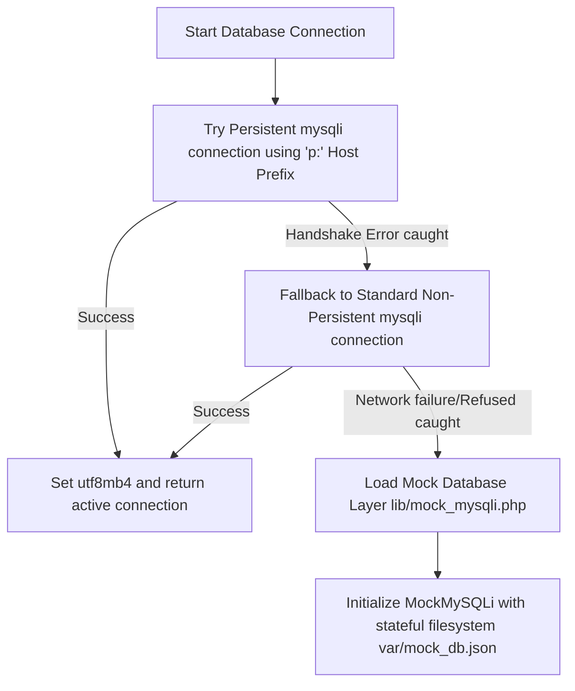
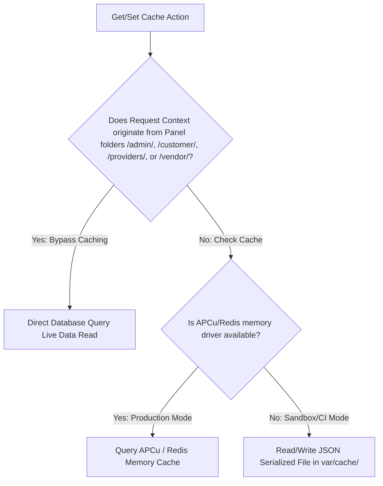
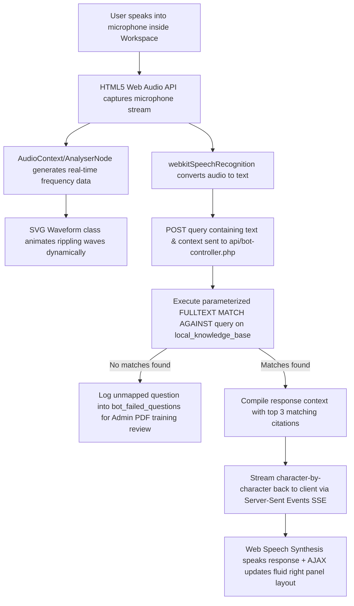
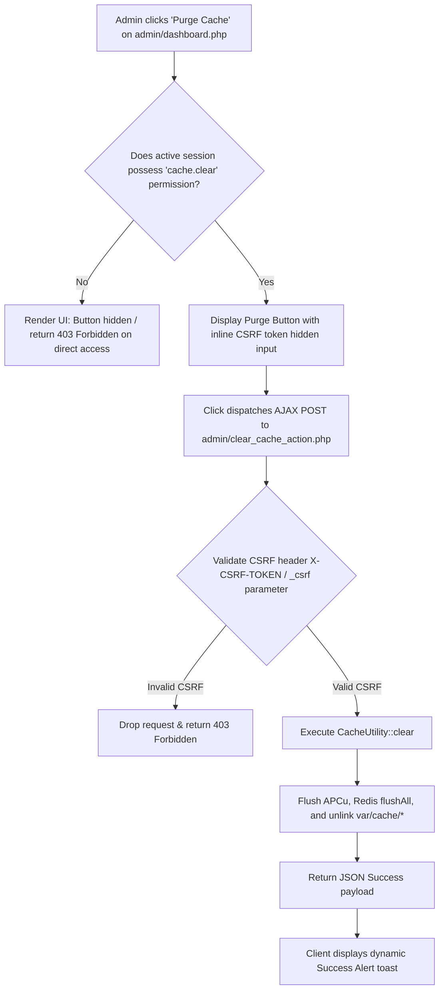
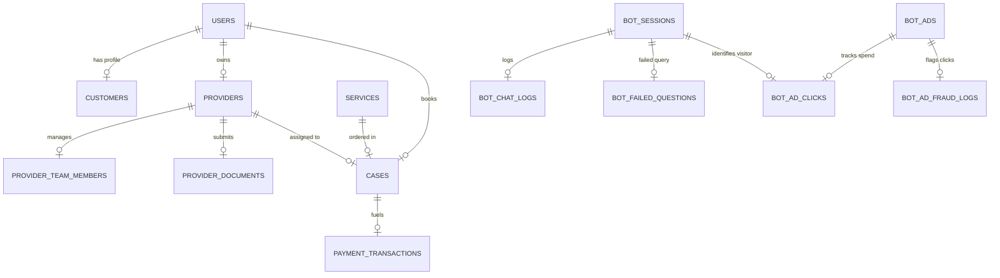

# GlobalWays Solutions Architecture: Comprehensive Optimization, Security, & System Blueprint

This document details the production-grade architectural design, complete directory/module topology, global platform infrastructure pipelines, modular optimization patterns, role-based access control (RBAC) security matrices, database schemas, and end-to-end testing profiles of the GlobalWays Marketplace application.

---

## 1. Repository-Wide Architecture & Core Module Tree

### A. Recursive Directory Catalog
The GlobalWays platform utilizes a highly organized, modular directory structure. Below is the comprehensive file-level catalog mapping of the entire application:

```
repository_root/
├── .htaccess                      # Web server configurations (Gzip compression, caching headers, CSP & HSTS)
├── php.ini                        # Core engine settings (OPcache with JIT compiler tracing enabled)
├── package.json                   # Client-side & development-side package definitions and scripts
├── playwright.config.js           # Configuration profile for E2E automated Playwright tests
├── PROJECT_SOW.md                 # System-wide Statement of Work & Product Specification manual
├── SECURITY_AUDIT.md              # Security audit manual & verification processes
├── FULL_SITE_SECURITY_REPORT.md   # Extensive penetration testing and vulnerability mitigation log
├── database.sql                   # Baseline core schema definition file
├── gpa_gw2.sql                    # Live synchronized master SQL database schema and seeds dump
│
├── admin/                         # System Administration Panel (Protected via RBAC)
│   ├── clear_cache_action.php     # Controller for administrative global cache purge
│   ├── dashboard.php              # Central dashboard home (renders dynamic panels conditional on permissions)
│   ├── import-pdf.php             # RAG document parsing controller utilizing pure-PHP PDF text extractor
│   ├── index.php                  # Root entry-point for administrative navigation
│   ├── login.php                  # Administrator-focused login screen
│   ├── login_post.php             # Administrator authentication logic with sliding-window rate limiting
│   ├── logout.php                 # Admin session termination controller
│   ├── phash.php                  # Cryptographic password hashing and verification helper
│   ├── provider_overview.php      # Aggregate review metrics interface for vendor performance
│   ├── password_reset_request.php # Admin password reset initiation handler
│   ├── password_reset_submit.php  # Admin password reset processing endpoint
│   │
│   ├── blog/                      # Admin editorial management
│   │   ├── create.php, edit.php, index.php, store.php, update.php, delete.php
│   ├── cms/                       # Static Content Management System routing
│   │   ├── index.php, update.php
│   ├── crm/                       # Customer Relationship Management controllers
│   │   ├── create.php, edit.php, index.php, store.php, update.php, delete.php, view.php
│   │   ├── failed-questions.php   # Audit panel tracking unanswered customer AI conversational queries
│   │   └── knowledge-base.php     # Manual view & creation dashboard for local RAG knowledge documents
│   ├── messages/                  # In-app customer support ticketing routing
│   │   ├── index.php, reply.php
│   ├── onboarding/                # Provider onboard workflows & state-machine reviews
│   │   ├── action.php, view.php
│   ├── permissions/               # Granular Security Permissions CRUD routing
│   │   ├── create.php, edit.php, index.php, store.php, update.php, delete.php
│   ├── providers/                 # Vendor details, moderation, and credentials verification
│   │   ├── assign_owner.php, assign_service.php, assign_service_store.php, create.php, index.php
│   │   ├── create_onboard.php, dashboard.php, delete.php, edit.php, impersonate.php, stop_impersonate.php
│   │   ├── onboarding_action.php, onboarding_list.php, onboarding_review.php, onboard_store.php
│   │   ├── store.php, submit_verification.php, update.php, verify.php, verify_document.php
│   ├── reviews/                   # Customer review moderation controllers
│   │   ├── create.php, create_store.php, index.php, action.php, review.php
│   ├── roles/                     # RBAC Roles Configuration
│   │   ├── create.php, edit.php, index.php, store.php, update.php, delete.php, sync_permissions.php
│   ├── service_categories/        # Services classification routing
│   │   ├── create.php, edit.php, index.php, store.php, update.php, delete.php
│   ├── service_tags/              # Meta tag optimization routing
│   │   ├── create.php, edit.php, index.php, store.php, update.php, delete.php
│   ├── services/                  # Global services inventory manager
│   │   ├── create.php, edit.php, index.php, store.php, update.php, delete.php
│   ├── settings/                  # Global system configuration consoles
│   │   ├── ai_status.php          # AI global Bot Kill-Switch toggle console
│   │   ├── bot_ads.php            # Contextual monetization manager & campaign creator
│   │   ├── bot_analytics.php      # Conversational node metric analysis reports
│   │   ├── deductions.php         # Super Admin Deduction percentage/flat fee controller
│   │   ├── entry-analytics.php    # Visual interactive entry-point metrics dashboard (Chart.js)
│   │   ├── features.php           # Feature flag controls
│   │   ├── landing_page.php       # Landing page content customizer
│   │   ├── menus.php              # Navigation menu structural builder
│   │   ├── payment-gateways.php   # Factory payment gateway configuration page
│   │   ├── testimonials.php       # Feedback management routing
│   │   └── update.php             # General settings save endpoint
│   └── users/                     # Account controls and profile routing
│       └── avatar_upload.php, create.php, edit.php, index.php, store.php, update.php, delete.php
│
├── api/                           # Global Application Programming Interfaces
│   ├── ad-revenue-charts.php      # Chart.js JSON metric feed for ad earnings
│   ├── accounting-report.php      # Multidimensional split-financial (gross, platform, net) metric controller
│   ├── bot-controller.php         # Core AI concierge controller (Server-Sent Events streaming & context matching)
│   ├── bot-transcript.php         # Conversational history JSON generator
│   ├── bot-upload-handler.php     # Immediate conversational attachment processor
│   ├── bot-ad-tracker.php         # Click-fraud protected billing tracker & redirector
│   ├── check-email.php            # On-the-fly register checks
│   ├── dashboard-charts.php       # Financial visual performance endpoint
│   ├── entry-point-charts.php     # Conversational entry auditing metrics
│   └── payment-webhook.php        # Replay-resistant Stripe payment hook handler
│
├── assets/                        # Shared static asset components (Images, Logos)
│   ├── logo.png
│   └── logo-white.png
│
├── css/                           # Global Cascading Style Sheets
│   ├── bootstrap.min.css          # Frontend layout foundation framework
│   ├── slimselect.css             # Rich dropdown visual structures
│   └── globalways.css             # Custom design, audio waveform, and layout classes
│
├── customer/                      # Customer Portal procedural directories
│   ├── application-detail.php     # In-depth application tracker
│   ├── applications.php           # Cases list interface
│   ├── checkout.php               # Tokenized server-side protected Stripe Elements checkout page
│   ├── documents.php              # Upload dashboard for customer documents
│   ├── index.php                  # Customer home console
│   ├── messages.php               # Ticketing messaging interfaces
│   ├── payments.php               # Ledger transactions view
│   ├── success.php                # Successful case checkout confirmation landing page
│   └── profile.php                # Customer target profile config page (Emirate, Goal, Nationality, etc.)
│
├── docs/                          # Platform architecture reports and blueprints
│   └── architecture_blueprint_report.md  # [Active Report File]
│
├── js/                            # Client-side JavaScript libraries and components
│   ├── main.js                    # Global layout dynamics & theme controls
│   ├── slimselect.js              # Multi-select widget controllers
│   └── notifications.js           # SSE event receiver and Web Push Notification notifier
│
├── lib/                           # Core Library Utility Helper Files
│   ├── anti_spam_helper.php       # HoneyPots, IP rate-limiting, disposable domain check, reCAPTCHA v3 helpers
│   ├── auth.php                   # Crypto browser-bound session controllers & Remember Me checkers
│   ├── cache_helper.php           # Production memory caches (APCu/Redis) with serialized local files fallback
│   ├── csrf.php                   # Session-bound CSRF token builders and validation gates
│   ├── customer_helpers.php       # SQL parameterized client interaction handlers
│   ├── db_mysqli.php              # Multi-tier persistent database driver layer
│   ├── middleware.php             # Role-based request interceptors and direct-access blockers
│   ├── mock_mysqli.php            # Stateful, JSON filesystem-persisted database mock compatibility layer
│   ├── monetization_helper.php    # Universal targeted layout ad placement engine
│   ├── notifications_helper.php   # System-wide alert & in-app message broadcasters
│   ├── notifier.php               # Dynamic mail and status trigger actions
│   ├── onboarding_helpers.php     # Vendor onboarding multi-step process workflows
│   ├── pagination.php             # Unified SQL query paginator
│   ├── payment_gateway_factory.php# Decoupled gateway interfaces (Stripe, PayPal, Authorize.net)
│   ├── permissions.php            # Active session user validation controls and override handlers
│   ├── providers_helpers.php      # Team and document directory trackers
│   ├── reviews_helpers.php        # Recalculates de-normalized averages & prevents rating system spam
│   ├── role_helpers.php           # Core user role settings CRUD helpers
│   ├── services_helpers.php       # Service query catalog engines
│   ├── settings_helper.php        # Database system configuration variables retriever
│   ├── upload.php                 # Filesize control & image upload constraint engine
│   ├── users_helpers.php          # Interactive user creations, deletion tracks, and invites
│   ├── uuid_helper.php            # Native UUID v4 generator
│   └── validation.php             # Email compliance checkers and strong password validators
│
├── migrations/                    # Schema creation scripts and core seeder tables
│   ├── admin_bot_migration.php, admin_cache_clear_permission.php, admin_fraud_migration.php,
│   ├── admin_monetization_migration.php, admin_rbac_seeding.php, admin_seed_admin.php,
│   ├── bot_migration.php, customer_migration.php, database_migration.php, rag_migration.php,
│   ├── seed_ad_test.php, seed_services.php, upgrade_index_migration.php, upgrade_migration.php
│   └── ...
│
├── partials/                      # Reusable visual header/footer structural elements
│   ├── footer.html, footer.php, frontend_footer.php, header.php, frontend_header.php
│   ├── navbar.html, sidebar.php, service_rating_widget.php
│   └── ...
│
├── providers/                     # Auxiliary service provider administration routes
│   └── dashboard.php, onboarding_status.php, onboard.php, ...
│
├── public/                        # Public file server resources
│   ├── assets/                    # Image galleries
│   └── uploads/                   # Secure isolated document storage directories
│
├── services/                      # Interactive public services list controls
│   └── index.php, show.php, view.php, reviews_list.php, review_submit.php
│
├── templates/                     # Global front-end interface skins
│   └── bot-widget.php             # Lightweight collapsible overlay assistant template (Web Speech API)
│
├── tests/                         # Production unit, integration, and E2E automated test suites
│   ├── CacheTest.php, HomepageCacheTest.php, InfrastructureTest.php, LocalRouteTest.php
│   ├── PasswordStrengthTest.php, PaymentComplianceTest.php, ServiceXssTest.php, SessionHijackTest.php
│   ├── TerminalInjectionTest.php, VendorReviewCacheTest.php, VendorsInputTest.php, WebhookSignatureTest.php
│   ├── admin-cache.spec.js        # Playwright RBAC cache clear spec
│   ├── globalways_uat.spec.js     # Master E2E visual & functional regression suite (24 tests)
│   └── test-login-helper.php      # E2E session mocking injector tool
│
├── var/                           # Local runtime file-based caching and database mocks
│   ├── cache/                     # Serialized backup cache directory
│   ├── scan_queue/                # Async antivirus processing queues
│   └── mock_db.json               # Filesystem physical state for `MockMySQLi`
│
├── vendor/                        # Dedicated Vendor Management Portal
│   └── team.php, profile.php, commission.php, cases.php, services.php, index.php
│
└── [Public Root Routing scripts]:
    ├── index.php                  # Platform homepage (1-hour query cache blocks, lazy-loaded components)
    ├── vendors.php                # Public parameterized directory search engine
    ├── vendor-profile.php         # Provider landing pages (dynamic progress bars, verified badge, team slider)
    ├── services.php               # Services catalog (infinite scroll with IntersectionObserver)
    ├── service-detail.php         # Deep detailed target service page (contextual headers, floating stick CTAs)
    ├── bot-landing.php            # Splitted immersive voice conversational chatbot environment
    └── [Authentication scripts]:
        ├── login.php, login_post.php, logout.php, register.php, register-vendor.php, vendor-onboard.php
```

---

### B. Component & Method Registry
An exhaustive index mapping all key modules, core helper classes, functions, and their interconnections across the codebase:

#### 1. Core Classes & Static Interfaces
*   **`CacheUtility` (`lib/cache_helper.php`)**: Manages environment-adaptive caching.
    *   `init()`: Resolves active driver (APCu vs local filesystem serialized fallback) and ensures `/var/cache` permissions.
    *   `should_bypass_cache()`: Intercepts request paths. Checks if `/admin/`, `/customer/`, `/providers/`, or `/vendor/` are present in script names or request URIs, forcing an immediate bypass (`return true`).
    *   `get($key)`: Fetches cached element. Performs deserialization if using the file-based fallback.
    *   `set($key, $value, $ttl)`: Stores serializable payloads.
    *   `delete($key)`: Invalidates cache key.
    *   `clear()`: Performed by administrative actions. Sweeps APCu, issues Redis `$redis->flushAll()`, and recursively unlinks file fragments in `/var/cache/`.
*   **`MockMySQLi` & `MockMySQLi_Result` / `MockMySQLi_Stmt` (`lib/mock_mysqli.php`)**:
    *   Simulates complete RAG document queries, transactional lookups, click-fraud windows, and user registrations directly against `var/mock_db.json` when the database is offline.
    *   Implements parameterized prepared statement bindings (`prepare()`, `bind_param()`, `execute()`, `get_result()`) with internal JSON filtering to guarantee full syntax-compatibility without a running MySQL daemon.
*   **`PaymentGatewayFactory` (`lib/payment_gateway_factory.php`)**: Decouples payment gateway configurations.
    *   `getGateway($name, $config)`: Returns a concrete object implementing `PaymentGatewayInterface` (`StripeGateway`, `PayPalGateway`, `AuthorizeNetGateway`).
    *   `getEnabledGateways()`: Leverages single-batch SQL query optimization to resolve active gateways.

#### 2. Functional Global Helpers (Procedural Interconnections)
*   **Database helpers (`lib/db_mysqli.php`)**: Establishes raw persistent mysqli links with cascading catch-blocks dropping down to non-persistent connections, and finally mock DB adapters.
*   **CSRF Engine (`lib/csrf.php`)**: Functions `csrf_token()`, `csrf_field()`, and `csrf_check($token)` providing session-bound CSRF validation.
*   **Authentication Guards (`lib/auth.php`)**:
    *   `validate_session_bindings()`: Cryptographically binds active session tokens to the client's `HTTP_USER_AGENT` and subnet mask, terminating the context immediately if drift is detected.
    *   `current_user()`, `attempt_login()`, `logout_user()`, `set_remember_me_cookie()`.
*   **Antivirus & File Handler (`lib/upload.php`)**:
    *   `file_upload_handle(...)` and `avatar_upload_handle(...)`: Enforce a maximum file boundary. Performs inline dimension constraint checks (strictly throwing exceptions for size distortions or profile dimensions over 500x500px).
    *   `enqueue_file_for_scan()`: Inserts raw paths into asynchronous scanning queues (`var/scan_queue/`) to execute server-side antivirus scanning.
*   **Notifications Engine (`lib/notifications_helper.php`)**:
    *   `create_notification($user_id, $title, $message, $target_url)`: Commits instant in-app alerts mapped to database IDs.
    *   `notify_admins()`, `notify_vendor()`, `notify_customer()`.
*   **On-the-fly Domain Checker (`lib/anti_spam_helper.php`)**:
    *   `is_disposable_email($email)`: Matches email domains against strict regular expressions and lists of temporary domain blocks.
    *   `check_rate_limit($mysqli)`: Enforces dynamic sliding-window limitations on user registration attempts (3 attempts in 5 minutes).

---

## 2. Global Platform Infrastructure & Connectivity Matrix

### A. Persistent Database Pipeline
To guarantee absolute runtime stability, the system uses a sophisticated **triple-tier connectivity fallback**. The active database initialization handles potential network failures cleanly:



---

### B. Environment-Adaptive Caching Engine
The platform implements an environment-adaptive caching layer designed to prioritize raw memory access in production and drop back tozero-dependency file segments in resource-constrained environments:



---

### C. Performance & Security Controls
1.  **OPcache & JIT Compilation (`php.ini`)**: OPcache is highly optimized with JIT compilation in `tracing` mode (`opcache.jit=tracing`), allowing the runtime to compile frequently used bytecode directly into raw machine instructions.
2.  **Asset Compression & Browser Caching (`.htaccess`)**: The Apache `.htaccess` uses standard gzip (`mod_deflate`) compression across CSS, HTML, and JavaScript assets. It enforces cache control headers on static images (`Cache-Control "max-age=31536000, public"`).
3.  **Strict Security Policy Enforcement (`partials/frontend_header.php`)**: Crucial headers are delivered natively via PHP, ensuring compatibility regardless of proxy layouts:
    *   **Content Security Policy (CSP)**: RESTRICTS script actions, preventing unauthorized inline execution.
    *   **Strict-Transport-Security (HSTS)**: Forces SSL connections (`max-age=31536000; includeSubDomains; preload`).
    *   **X-Frame-Options**: Set to `SAMEORIGIN` to prevent clickjacking.
4.  **Automated Infrastructure Audits (`tests/InfrastructureTest.php`)**: A dedicated suite parses `php.ini`, `.htaccess`, and global headers to ensure compliance across all environments, preventing accidental security drift.

---

## 3. Module-by-Module Feature & Optimization Blueprint

### A. Public Frontend Modules

#### 1. Page & Route Specifications
*   **`index.php` (Platform Homepage)**: Renders direct consultancy portals and promotional zones.
*   **`vendors.php` (Directory Listing)**: Lists professional providers with live filtering.
*   **`vendor-profile.php` (Public Provider Profile)**: Displays team credentials, public documents, and overall rating distributions.
*   **`services.php` (Dynamic Catalog)**: Infinite scroll-enabled catalog displaying various packages.
*   **`service-detail.php` (Service Checkout Page)**: In-depth service details, package parameters, and payment initiation anchors.

#### 2. Key UX & Performance Optimizations
*   **1-Hour Query Cache Blocks**: Heavy queries (such as listing available service categories or general statistics) are cached for exactly 1 hour (`3600s`) via `CacheUtility` to reduce database load.
*   **Asynchronous Infinite Scroll**: `services.php` uses a native browser `IntersectionObserver` to trigger AJAX pagination requests as the user reaches the bottom of the page, avoiding heavy paginated page loads.
*   **Progressive De-normalized Averages**: Average ratings and rating counts are de-normalized directly into `providers.rating_cache` columns upon review approval. This avoids heavy, slow `AVG()` and `COUNT()` SQL joins.
*   **Review Distribution Progress Bars**: `vendor-profile.php` features visual percentage progress bars showing the distribution of reviews across 1-star to 5-star ratings.
*   **Floating Sticky Call-to-Action**: `service-detail.php` features a sticky, highly visible CTA sidebar that locks to the viewport during page scroll, guiding users toward immediate booking checkout.
*   **Browser-Side Link Pre-fetching**: Public navigation anchors contain lightweight hover pre-fetching triggers, warming up browser cache prior to client clicks.
*   **Image Upload Constraints**: Vendor avatars and document previews are processed on upload (`lib/upload.php`) to strictly enforce a maximum 500x500px resolution layout constraint, keeping pages responsive.

---

### B. Conversational AI Workspace & APIs

#### 1. Page & Route Specifications
*   **`bot-landing.php` (Immersive Workspace)**: Full split-screen panel (400px fixed Sidebar with Web Audio frequency visualizations; fluid Right Panel showing dynamically swapped page layout contexts).
*   **`api/bot-controller.php` (Conversational Engine)**: Standardizes text, audio, and language context requests.
*   **`api/bot-ad-tracker.php` (Anti-Fraud Click Tracker)**: Logs monetized conversational ad link interactions with click-fraud validations.

#### 2. Core Interactive voice & RAG Ingestion Flow



#### 3. Control Character Mitigation
To block command injection or terminal escape sequence bypasses inside voice logging environments, `api/bot-controller.php` strictly strips out raw terminal control characters (e.g. ASCII ranges `0-31` and `127`) and applies aggressive `htmlspecialchars(..., ENT_QUOTES, 'UTF-8')` filtering prior to database commits.

---

### C. Gateway Protocols & Secure Transaction Pipelines

#### 1. Verification & Checkout Routes
*   **`register.php` / `register-vendor.php`**: Secure user registration.
*   **`login_post.php`**: Rate-limited proxy-aware authentication handler.
*   **`customer/checkout.php`**: Client-side Stripe Elements handler.
*   **`api/payment-webhook.php`**: Signature-verified payment processor.

#### 2. Key Transactional Features
*   **Real-time Availability Checks**: `api/check-email.php` runs asynchronous AJAX checks as the user types, verifying domain and email uniqueness without form-submission cycles.
*   **Proxy-Aware Brute-Force Rate Limiting**: `login_post.php` prevents brute-force attacks by limiting IP addresses to a maximum of 5 failed attempts within a 5-minute sliding window. The system resolves client IPs safely using both `REMOTE_ADDR` and `HTTP_X_FORWARDED_FOR` headers.
*   **Sliding Window Event Scheduler**: On registration, a background database scheduler cleans up expired temporary session assets older than 24 hours.
*   **Cryptographically Signed Remember Me Cookies**: Employs secure HMAC-SHA256 signatures to bind user IDs, preventing token-forgery or cookie-alteration attacks.
*   **Server-Side Price Protection**: Prior to charging, `customer/checkout.php` ignores client-side pricing and refetches the service price directly from the database, preventing price-tampering.
*   **Tokenized Stripe Elements Workflows**: Credit card data is collected via iframe elements and tokenized directly on Stripe servers. No raw card numbers or CVV codes ever touch the application's memory.
*   **Replay-Resistant Stripe Webhooks**: `api/payment-webhook.php` uses strict Stripe cryptographic signature verification against `STRIPE_WEBHOOK_SECRET`, validating the timestamp within a 5-minute window to block replay attacks.
*   **Instant Server-Sent Events (SSE) Streams**: Dynamic notifications are dispatched in real-time. The SSE listener `/js/notifications.js` automatically detaches during local automated Playwright test sessions to prevent blocking the single-threaded PHP built-in server.

---

## 4. Control Panel Caching Restrictions & RBAC Matrix

### A. Live Data Enforcement Matrix (Cache Bypass)
To prevent serving stale data, the optimization layer inside `lib/cache_helper.php` strictly bypasses all read/write cache operations for requests containing these directory contexts:

| Subdirectory Panel | Context Rule | Cached Status | DB Pipeline |
| :--- | :--- | :---: | :--- |
| **`/admin/`** | Contains Administrative CRM/Accounting Views | **BYPASSED** | 100% Direct Real-Time Queries |
| **`/customer/`**| Contains Client Bookings/Ticketing Modules | **BYPASSED** | 100% Direct Real-Time Queries |
| **`/providers/`**| Legacy Service Provider onboarding | **BYPASSED** | 100% Direct Real-Time Queries |
| **`/vendor/`** | Vendor Team, Cases & Financial ledgers | **BYPASSED** | 100% Direct Real-Time Queries |

---

### B. Admin Cache Clearance Utility & RBAC Flow
The administrative cache purge feature on the admin dashboard (`admin/dashboard.php`) is protected by multi-layer security validation:



---

### C. Automation Validation Profile (Playwright Tests)
We enforce continuous verification of the caching and RBAC structures via Playwright E2E suites running in headless test pipelines:

*   **File Path**: `tests/admin-cache.spec.js`
*   **Test Cases covered**:
    1.  **Role Verification (Possessing `cache.clear`)**: Authenticates a user with explicit cache clearance permissions via `tests/test-login-helper.php`, navigates to `/admin/dashboard.php`, verifies button visibility, triggers cache purge, and asserts the success toast is present in the DOM.
    2.  **Role Restriction (Lacking `cache.clear`)**: Authenticates a user without the permission, and asserts the clearance action button is completely removed/detached from the DOM.
    3.  **Direct Route Access Block (Guest/Unauthorized)**: Sends an unauthenticated POST request directly to `/admin/clear_cache_action.php` and asserts that the server rejects the request with an explicit `403 Forbidden` status code.

---

## 5. Database Schema & Relational Model Map

Here is the complete relational mapping of all 13 core database tables running within the GlobalWays Marketplace system.

### Table Relationships (Crow's Foot Schema)



---

### Comprehensive Column Mappings & Schema Definitions

#### 1. `users`
Tracks system-wide user credentials, status, and role associations.
*   **Columns**:
    *   `id`: `INT(10) UNSIGNED AUTO_INCREMENT` [PK]
    *   `name`: `VARCHAR(255)`
    *   `email`: `VARCHAR(255)` [Unique]
    *   `password`: `VARCHAR(255)`
    *   `remember_token`: `VARCHAR(100)`
    *   `created_at`: `TIMESTAMP DEFAULT CURRENT_TIMESTAMP`
*   **Indexes**: Unique index on `email`.

#### 2. `cases`
Manages customer bookings, application states, and financial parameters.
*   **Columns**:
    *   `id`: `INT(10) UNSIGNED AUTO_INCREMENT` [PK]
    *   `uuid`: `CHAR(36)` [Unique]
    *   `user_id`: `INT(10) UNSIGNED` [FK -> `users.id`]
    *   `service_id`: `INT(10) UNSIGNED` [FK -> `services.id`]
    *   `provider_id`: `INT(10) UNSIGNED` [FK -> `providers.id`]
    *   `status`: `ENUM('PENDING', 'QUOTED', 'BOOKED', 'DECLINED') DEFAULT 'PENDING'`
    *   `due_amount`: `DECIMAL(10,2)`
    *   `paid_amount`: `DECIMAL(10,2)`
    *   `created_at`: `TIMESTAMP`
    *   `updated_at`: `TIMESTAMP ON UPDATE CURRENT_TIMESTAMP`
*   **Indexes**:
    *   `user_id` Index
    *   `service_id` Index
    *   `provider_id` Index
    *   `uuid` Unique Index

#### 3. `payment_gateways`
Maintains decoupled credentials for Payment Gateway concrete adapters.
*   **Columns**:
    *   `id`: `INT(10) UNSIGNED AUTO_INCREMENT` [PK]
    *   `gateway_name`: `VARCHAR(100)` [Unique]
    *   `public_key`: `VARCHAR(255)`
    *   `secret_key`: `VARCHAR(255)`
    *   `sandbox_mode`: `TINYINT(1) DEFAULT 1`
    *   `is_enabled`: `TINYINT(1) DEFAULT 1`
    *   `updated_at`: `TIMESTAMP ON UPDATE CURRENT_TIMESTAMP`

#### 4. `notifications`
Tracks user notifications, badges, and Web Push redirect destinations.
*   **Columns**:
    *   `id`: `INT(10) UNSIGNED AUTO_INCREMENT` [PK]
    *   `user_id`: `INT(10) UNSIGNED` [FK -> `users.id`]
    *   `title`: `VARCHAR(255)`
    *   `message`: `TEXT`
    *   `is_read`: `TINYINT(1) DEFAULT 0`
    *   `target_url`: `VARCHAR(255)`
    *   `created_at`: `TIMESTAMP DEFAULT CURRENT_TIMESTAMP`
*   **Indexes**: `user_id` Index

#### 5. `bot_nodes`
Maintains conversational tree layouts mapped across multi-lingual locales.
*   **Columns**:
    *   `id`: `INT(10) UNSIGNED AUTO_INCREMENT` [PK]
    *   `parent_id`: `INT(10) UNSIGNED` [Self-Referential FK -> `bot_nodes.id` on delete CASCADE]
    *   `node_type`: `VARCHAR(50)`
    *   `language_iso`: `VARCHAR(10)`
    *   `display_text`: `TEXT`
    *   `spoken_text`: `TEXT`
    *   `target_action`: `VARCHAR(100)`
*   **Indexes**: `parent_id` Index

#### 6. `bot_sessions`
Manages stateful interaction timelines, tracking user sessions and selected languages.
*   **Columns**:
    *   `id`: `INT(10) UNSIGNED AUTO_INCREMENT` [PK]
    *   `session_token`: `VARCHAR(64)` [Unique]
    *   `user_id`: `INT(10) UNSIGNED` [FK -> `users.id` on delete SET NULL]
    *   `selected_language`: `VARCHAR(10)`
    *   `current_node_id`: `INT(10) UNSIGNED` [FK -> `bot_nodes.id` on delete SET NULL]
    *   `entry_point`: `VARCHAR(100) DEFAULT 'GENERAL_PAGE'`
    *   `created_at`: `TIMESTAMP DEFAULT CURRENT_TIMESTAMP`
*   **Indexes**: Unique index on `session_token`.

#### 7. `bot_chat_logs`
Stores detailed conversational transcripts for audit logging.
*   **Columns**:
    *   `id`: `INT(10) UNSIGNED AUTO_INCREMENT` [PK]
    *   `session_id`: `INT(10) UNSIGNED` [FK -> `bot_sessions.id` on delete CASCADE]
    *   `sender`: `ENUM('USER', 'BOT')`
    *   `message_content`: `TEXT`
    *   `created_at`: `TIMESTAMP DEFAULT CURRENT_TIMESTAMP`
*   **Indexes**: `session_id` Index

#### 8. `local_knowledge_base`
Enables fast, self-hosted, cloud-free local RAG search.
*   **Columns**:
    *   `id`: `INT(10) UNSIGNED AUTO_INCREMENT` [PK]
    *   `file_name`: `VARCHAR(255)`
    *   `document_category`: `VARCHAR(100)`
    *   `page_number`: `INT(10) UNSIGNED`
    *   `text_content`: `LONGTEXT`
    *   `created_at`: `TIMESTAMP DEFAULT CURRENT_TIMESTAMP`
*   **Indexes**:
    *   `IDX_TEXT_CONTENT`: `FULLTEXT` index mapped on `text_content` to enable fast, sub-linear lookup speed using `MATCH() AGAINST()`.

#### 9. `bot_failed_questions`
Audits unanswered user questions to help admins update the RAG system.
*   **Columns**:
    *   `id`: `INT(10) UNSIGNED AUTO_INCREMENT` [PK]
    *   `session_id`: `INT(10) UNSIGNED` [FK -> `bot_sessions.id` on delete CASCADE]
    *   `unanswered_question`: `TEXT`
    *   `page_context_url`: `VARCHAR(255)`
    *   `created_at`: `TIMESTAMP DEFAULT CURRENT_TIMESTAMP`
*   **Indexes**: `session_id` Index

#### 10. `payment_transactions`
Audits system split financials (Gross collected, Platform fees, and Net payable).
*   **Columns**:
    *   `id`: `INT(10) UNSIGNED AUTO_INCREMENT` [PK]
    *   `transaction_id`: `VARCHAR(255)` [Unique]
    *   `case_id`: `INT(10) UNSIGNED` [FK -> `cases.id` on delete SET NULL]
    *   `gross_amount`: `DECIMAL(10,2)`
    *   `platform_fee`: `DECIMAL(10,2)`
    *   `vendor_net_amount`: `DECIMAL(10,2)`
    *   `created_at`: `TIMESTAMP DEFAULT CURRENT_TIMESTAMP`
*   **Indexes**: Unique index on `transaction_id`.

#### 11. `bot_ads`
Manages targeted direct sponsor banners and fallback programmatic campaigns.
*   **Columns**:
    *   `id`: `INT(10) UNSIGNED AUTO_INCREMENT` [PK]
    *   `campaign_name`: `VARCHAR(255)`
    *   `ad_source_type`: `ENUM('DIRECT_SPONSOR', 'NETWORK_PROGRAMMATIC')`
    *   `placement_zone`: `ENUM('BOT_INTERNAL_CHAT', 'SITE_HEADER_LEADERBOARD', 'SITE_SIDEBAR_BANNER', 'SITE_FOOTER_BANNER')`
    *   `target_page_context`: `VARCHAR(255) DEFAULT 'GLOBAL_FALLBACK'`
    *   `target_category_id`: `INT(10) UNSIGNED` [FK -> `service_categories.id` on delete SET NULL]
    *   `language_iso`: `VARCHAR(10) DEFAULT 'EN'`
    *   `banner_text`: `TEXT`
    *   `audio_speech_text`: `TEXT`
    *   `destination_url`: `VARCHAR(255)`
    *   `network_script_code`: `LONGTEXT`
    *   `click_cost`: `DECIMAL(10,2)`
    *   `max_budget`: `DECIMAL(10,2)`
    *   `current_spend`: `DECIMAL(10,2)`
    *   `ad_billing_model`: `ENUM('PPC', 'PPI', 'FLAT_RATE_TEMPORAL') DEFAULT 'PPC'`
    *   `max_impressions`: `INT(10) UNSIGNED`
    *   `current_impressions`: `INT(10) UNSIGNED`
    *   `start_date`: `DATETIME`
    *   `end_date`: `DATETIME`
    *   `is_active`: `TINYINT(1) DEFAULT 1`
    *   `created_at`: `TIMESTAMP DEFAULT CURRENT_TIMESTAMP`
    *   `updated_at`: `TIMESTAMP ON UPDATE CURRENT_TIMESTAMP`
*   **Indexes**: `target_category_id` Index

#### 12. `bot_ad_clicks`
Tracks user clicks on contextual sponsor banners.
*   **Columns**:
    *   `id`: `INT(10) UNSIGNED AUTO_INCREMENT` [PK]
    *   `ad_id`: `INT(10) UNSIGNED` [FK -> `bot_ads.id` on delete CASCADE]
    *   `session_id`: `INT(10) UNSIGNED` [FK -> `bot_sessions.id` on delete SET NULL]
    *   `earned_amount`: `DECIMAL(10,2)`
    *   `clicked_at`: `TIMESTAMP DEFAULT CURRENT_TIMESTAMP`
*   **Indexes**: `ad_id` and `session_id` Indexes

#### 13. `bot_ad_fraud_logs`
Secures advertisers from click fraud using sliding-window verification.
*   **Columns**:
    *   `id`: `INT(10) UNSIGNED AUTO_INCREMENT` [PK]
    *   `ad_id`: `INT(10) UNSIGNED` [FK -> `bot_ads.id` on delete CASCADE]
    *   `ip_address`: `VARCHAR(45)`
    *   `clicked_at`: `TIMESTAMP DEFAULT CURRENT_TIMESTAMP`
*   **Indexes**: `ad_id` Index
*   **Functional Anti-Fraud Lock**: IP Click occurrences are checked dynamically on click events to ensure they do not exceed 3 clicks per hour, protecting advertiser budgets.

---

### Voice Assistant Refinements (Voice Interactivity Upgrades)
To deliver a premium, seamless voice workspace experience, the following system refinements were introduced:

1. **Persistent Listening Mode (Continuous Microphone Stream)**:
   - Evaluates the standard Web Speech API (`SpeechRecognition`) and custom workspace lifecycles.
   - Restarts the speech recognition stream programmatically inside the `onend` event handler of both standard and immersive views (`templates/bot-widget.php` and `bot-landing.php`) if the mic trigger remains enabled (`isListening === true`) and the bot is not speaking.
   - Strictly honors user manual overrides by killing the listening loop and cleaning up variables when toggled off.
   - Prevents feedback loops by temporarily pausing/suspending speech recognition immediately before `speechSynthesis.speak()` triggers and auto-resuming it upon the synthesis utterance firing `onend` or `onerror`.

2. **Multilingual Spoken Language Selection Parsing**:
   - Parses and normalizes transcription strings against case-insensitive regex patterns for English, French, Arabic, and Urdu/Hindi spoken natively (e.g. "Anglais", "الانجليزية", "انگریزی", etc.).
   - Automatically maps matched language utterances to corresponding physical button elements in the options menu and programmatically dispatches `.click()` events, preserving identical system transition pathways.

3. **Voice-Driven Option / Dynamic Menu Selection**:
   - Stores active options inside a client-side global array (`activeOptions`) whenever new options are rendered.
   - Employs a case-insensitive keyword match pattern (direct contains and word-by-word intersection) comparing transcripts against stored options (e.g., matching "Browse" to "Browse Independently").
   - Automatically purges and completely clears `activeOptions` on node changes or resets to prevent stale collisions.

4. **Post-Language Selection Redirection & Hydration**:
   - Detects when a language selection node transitions inside the standard floating widget (`templates/bot-widget.php`).
   - Cleanly persists the active session context and language configuration securely inside LocalStorage, and executes an instantaneous window redirection to `bot-landing.php`.
   - On the immersive workspace page (`bot-landing.php`) itself, the redirection logic is bypassed to preserve view state, and LocalStorage values are used to smoothly hydrate workspace state upon mount.

5. **CSP Compliance & Event Binding Refactoring**:
   - Eliminated inline `onclick` attributes and `javascript:` URLs from theme toggles (`partials/frontend_header.php`), mic trigger, and reset buttons (`bot-landing.php`).
   - Cleanly bound CSP-compliant event listeners inside nonce-protected script tags on `DOMContentLoaded` to pass strict Content Security Policy directives.

6. **Playwright E2E Test Suite Addition**:
   - Built a comprehensive Playwright suite (`tests/voice-interactivity.spec.js`) containing 4 exhaustive tests simulating continuous listening, multilingual translation parsing, option selection keywords, and redirection/hydration, completely mocked for headless CI environments.

---

This blueprint serves as the definitive reference manual for the GlobalWays marketplace, guaranteeing maintainable development patterns, strong security boundaries, and high-performance operation.
